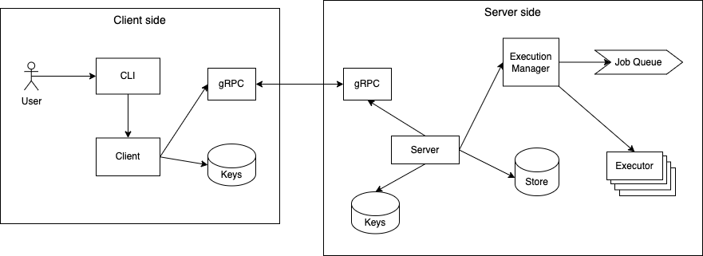

# Remote Linux Command Executor

This library provides a server to run Linux commands asynchronously.
It schedules a received command and returns a job id to the requester, who can later query for the results or cancel the job.

## Terminology

* Command: any executable program that is available on the machine running the service
* CLI : an executable on the client side that parses the request from the user and calls client to process the command
* Client: the process on the client side that configures and uses gRPC to invoke operations on the server side
* Server: the server side of the client-server communication, where the server runs
* Storage: a temporary data structure storing information about existing users, roles and jobs
* Job: an object with information about a scheduled command including requester, command and output channel

## Overview

The architecture for the service is represented on the diagram below:



When a user calls the CLI to run a command on the remote linux server the following sequence of operations happen:

1. the CLI parses and validates the command
1. the CLI calls the Client, which reads the TLS keys from local storage, formats the input arguments into the appropriate object and calls the operation on the server using gRPC
1. on the server side, the server opens a net listener and accepts requests from the client side using gRPC. When configuring gRPC, the server uses the keys from local storage.
1. the Server starts the Execution Manager, which creates a Job Queue to store the commands to be executed.
1. the Execution Manager also creates the Executors necessary to execute the jobs, controlling a pool of executors to guarantee that the server is not overwhelmed.
1. when receiving a new command, the server validates on local storage if the appropriate permissions
1. for a `run` command, the Server calls the Execution Manager to enqueue a command for execution.
1. for the other commands, the Server returns the status or deletes the Job from the Storage.

We expand on the details below.

## Authorization

When the Server receives a request, first it validates if the user is in the Storage.
It will extract the email from the CommonName in the certificate and will run `Storage.GetUserId(email)` to see if the user exists.

If the user exists, the authorization is based on the operation. For new commands, there is no validation necessary. For query or delete a Job, the server will extract the identity from the authorization info in the request's context and verify in `Storage.Authorized(userId, jobId)` if the user requesting the operation is the same that created the Job.

## CLI

The CLI is a simple Go main package that parses the input from the user and validates if it follows the required syntax.

These are the operations accepted:

* `run <command>` schedules a command to be executed and returns an id for the scheduled job.

* `get <job id>` searches for the scheduled job. If available returns its status and output.

* `del <job id>` deletes a scheduled job.

Command helper message explaining how it works:

```
$ rlcp
rlcp - Remote Linux Command Processor

Usage: rlcp operation argument
   
OPERATIONS
    --help
        shows this prompt

    run <command>
        schedules the <command> parameter for execution. <command> should be a single word or if multiple words, encapsulated by double quotes.
        this command returns a job id to be used to either query or delete the job later.

        Examples:
         rlcp run pwd
         rlcp run "ls -la"
         rlcp run "tail -f server.log"
    
    get <job id>
        gets the status and output (if available) of a scheduled job

        Example:
        rlcp get bf7a1eae-8d25-4de5-995b-8c4d3ef8b848
    
    del <job id>
        deletes a scheduled job

        Example:
        rlcp del af1f8215-bee7-455d-874a-55f0e3fb20b5
```

## Client

Users invoke a CLI command to execute a remote command on a server.

First the CLI command parses and validates the command line arguments. 

If the CLI command is valid, the client reads the local client certificate and key from `./x509/client_cert.pem` and `./x509/client_key.pem` respectively. It will error if the files are not present.

Additionally the client reads the server's CA certificate, which may not be the same as the client's from `./x509/ca_cert.pem`.

For this exercize we will use a 2048-bit RSA keys for both the server and the client.

With the command arguments and certificate, the client will invoke the appropriate gRPC methods to communicate with the server.

## Server

The server opens a TCP listener on port 50001 and uses that listener to start a gRPC server.

Before starting the gRPC server, the server reads the following keys from the local filesystem:

`./x509/client_ca_cert.pem`: the client CA certificate. The client CA may be different from the server's.<br />
`./x509/server_key.pem`: the server's private key.<br />
`./x509/server_cert.pem`: the server's certificate with its counterpart public key.

If the server fails to read any of the keys or certificates, it logs an error message and exits.

With the keys loaded, the server starts a gRPC server with the TLS transport credentials listed above. The gRPC server also validates the caller identity on every request before parsing more fine-grained authorization.

## gRPC

This is the protocol buffers definition for the remote executor service:

```
syntax = "proto3";

option go_package = ".;pb";

service RemoteExecutor {
	// Enqueues a command for execution on the server
	rpc ExecCommand (CmdRequest) returns (EnqueuedJobDetails) {}
    // Gets the status and if available output from the command
	rpc GetResult (GetRequest) returns (stream JobOutput) {}
    // Deletes a job from the queue. If the command is still running, it is cancelled
    rpc DeleteJob (DeleteRequest) returns (Deleted) {}
  }
  
  // The request message containing the command
  message CmdRequest {
	  string command = 1;
  }

  // The response message containing job id
  message EnqueuedJobDetails {
	  string job_id = 1;
  }

  // The request for a Job status
  message GetRequest {
    string job_id = 1;
  }
  
  // The response for a Get Job, with the combined output from stdout and stderr
  message JobOutput {
    oneof result {
      bytes output = 1;
      // inform here if the job hasn't started yet or some othe issue happened
      message string = 2;
    }
  }

  // The request for a Delete operation containing the job id
  message DeleteRequest {
    string job_id = 1;
  }

  // The result of a Delete operation
  message Deleted {
    bool deleted = 1;
    string message = 2;
  }
  ```

It is a very simple API implementing the three basic operations to schedule, query and delete a command.

All of them call an authorizer to validate that the requester has the appropriate permissions for the operation.

## Storage

Currently all information about users and jobs is stored in memory, but it can be later stored in key value stores, SQL databases or any other data structure implementing the following interface:

```
// JobStore defines the methods persist and access job relevant data.
type JobStore interface {
	// GetUserId returns the UUID for the user matching the identifier on the request
	GetUserId(identifier string) (string, bool)
	// Authorized validates if the user requesting an operation on a job is the same that scheduled it
	Authorized(userId, jobId string) bool
	// Schedules a command for the user
	ScheduleCommand(userId, command string)
	// Gets the status and output for a Command.
	// When the command finishes executing and the Out channel is drained, the response is deleted from the storage.
	GetResponse(userId, jobId string) (*Response, bool)
	// Deletes the job from the storage
	DeleteJob(userId, jobId string) bool
}

type Response struct {
	Status string // pending, running, finished
	Out    chan []byte
}
```

## Execution Manager

The Execution Manager controls Job Queue and create Go routines to instantiate Executors to run the Jobs.

Its purpose is to allow a client to schedule a job asynchronously, getting a Job Id right away, and get it processed later. It also controls the number of executors running, allowing a configuration between resources utilization latency.

## Executor

The executor is the Go routine that will actually call the OS to run the command. Some commands like `pwd` may run completely and return the output instantly. Others, like `top` may not complete unless cancelled or errored. For those scenarios we can run multiple executors, to allow for parallel command execution.

This is the flow of actions for an executor:

1. takes a Job from the Job Queue (guarded by a mutex)
1. uses the `os/exec` library to run the command on the OS
1. creates a buffered channel listening to `stdout` and `stderr` and writes the output to `Job.Out`
1. if the output fits in the buffered channel and the command completes, the executor will end this cycle and pick up the next Job
1. if the output doesn't fit `Job.Out`, it will block. When the client queries for the Job response, they will stream what's already in the buffer plus what is being produced.
1. that will continue indefinitely until the process finishes executing or the user Deletes it.
1. a few tests/actions are needed here:
    + when the buffer channel is full, what happens to `strout` if it keeps filling?
    + we should either add a timeout or some other buffer like disk storage to avoid blocking the worker.
