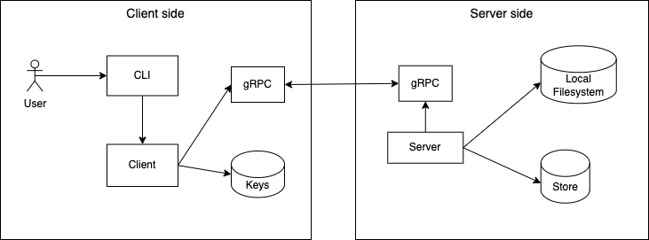

# Remote Linux Command Executor

This library provides a server to run Linux commands asynchronously.
It schedules a received command and returns a job id to the requester, who can later query for the results or cancel the job.

## Terminology

* User: a human or script calling the CLI to run a command on a remote Linux server
* Command: any executable program that is available on the machine running the service
* CLI : an executable on the client side that parses the request from the user and calls client to process the command
* Client: the process on the client side that configures and uses gRPC to invoke operations on the server side
* Server: the server side of the client-server communication, where the server runs
* Storage: a temporary data structure storing information about existing users, roles and jobs
* Job: an object to refer to a command that was issued on a remote Linux machine with additional information like Id, status and output

## Overview

The architecture for the service is represented on the diagram below:



When a user calls the CLI to run a command on the remote Linux server the following sequence of operations happen:

1. the CLI parses and validates the command
1. the CLI calls the Client, which reads the TLS keys from local storage and adds the config to the transport credentials. It then formats the input arguments into the appropriate object and calls the operation on the server using gRPC.
1. on the server side, the server opens a net listener and accepts requests from the client side using gRPC. When configuring gRPC, the server uses the keys from local storage.
1. the server will then extract the user identification from the certificate CN authorize the request. Please look at the [Authorization](#authorization) section below for details.

We expand on the details below.

## Authorization

When the Server receives a request, first it validates if the user is in the Storage.
It will extract the email from the CommonName in the certificate and will run `Storage.GetUserId(email)` to see if the user exists.

The Storage will contain a map of users to roles.
The users key will be an email and the roles eiter `general` or `readonly`. 

If the user exists, each gRPC method will perforn a specific authorization. `ExecCommand()` and `StopJob()` require the user to have a `general` role, while for `GetStatus()` and `GetOutput`, either `general` or `readonly` is valid.

## CLI

The CLI is a simple Go main package that parses the input from the user and validates if it follows the required syntax.

These are the operations accepted:

* `run <command>` calls the server to execute the provided command. Retures a Job Id identifying the job or an error message if the user doesn't have the permissions.

* `status <job id>` queries the status of an Job on the server. The available statuses are: `running`, `completed`, `errored`, `stopped`.

* `output <job id>` gets the output for a Job. If the command is still running, the output will be streamed until the Job completes or is stopped.

* `stop <job id>` stops a running job. If the job is already stopped, or the user doesn't have the necessary permission, an error message will be informed.

Command helper message explaining how it works:

```
$ rlcp
rlcp - Remote Linux Command Processor

Usage: rlcp operation argument
   
OPERATIONS
    --help
        shows this prompt

    run <command>
        runs the informed <command> on the server. <command> should be a single word or if multiple words, encapsulated by double quotes.
        this command returns a job id to be used to either query the status, get the output or stop the job later.

        Examples:
         rlcp run pwd
         rlcp run "ls -la"
         rlcp run "tail -f server.log"
    
    status <job id>
        gets the status for the job or an error message if the id is invalid or the user doesn't have the appropriate permissions.

        Example:
        rlcp status bf7a1eae-8d25-4de5-995b-8c4d3ef8b848
    
    output <job id>
        prints the output for the job or an error message if the id is invalid or the user doesn't have the appropriate permissions.

        Example:
        rlcp output 8060271e-b776-4444-9e75-bd2e3db3cc7d

    stop <job id>
        stops the job identified by job id. Returns an error message if the id is invalid or the user doesn't have the appropriate permissions.

        Example:
        rlcp stop af1f8215-bee7-455d-874a-55f0e3fb20b5
```

## Client

Users invoke a CLI command to execute a remote command on a server.

First the CLI command parses and validates the command line arguments. 

If the CLI command is valid, the client reads the local client certificate and key from `./x509/client_cert.pem` and `./x509/client_key.pem` respectively. It will error if the files are not present.

Additionally the client reads the server's CA certificate from `./x509/server_ca_cert.pem`.

Both the client and the server use a 2048-bit RSA keys for mTLS.

With the command arguments and certificate, the client will invoke the appropriate gRPC methods to communicate with the server.

## Server

The server opens a TCP listener on port 50001 and uses that listener to start a gRPC server.

Before starting the gRPC server, the server reads the following keys from the local filesystem:

`./x509/client_ca_cert.pem`: the client CA certificate.<br />
`./x509/server_key.pem`: the server's private key.<br />
`./x509/server_cert.pem`: the server's certificate with its counterpart public key.

The TLS configuration expects the TLS min and max versions being 1.3:

```
// TLS config on the server
config := tls.Config{
    ClientAuth:            tls.RequireAndVerifyClientCert,
    Certificates:          []tls.Certificate{cert},
    ClientCAs:             ca,
    VerifyPeerCertificate: authorizeClient,
    MinVersion:            tls.VersionTLS13,
    MaxVersion:            tls.VersionTLS13,
}
```

If the server fails to read any of the keys or certificates, it logs an error message and exits.

With the keys loaded, the server starts a gRPC server with the TLS transport credentials listed above. The gRPC server also validates the caller identity on every request before parsing more fine-grained authorization.

## gRPC

This is the protocol buffers definition for the remote executor service:

```
syntax = "proto3";

option go_package = ".;pb";

service RemoteExecutor {
    // Runs a command on the server and returns the Job details
    rpc ExecCommand (CmdRequest) returns (JobDetails) {}

    // Gets the status of a Job
    rpc GetStatus (GetRequest) returns (JobDetails) {}

    // Gets the output for the requested Job Id
    rpc GetOutput (GetRequest) returns (stream JobOutput) {}

    // Stops a job. 
    rpc StopJob (StopRequest) returns (StopResponse) {}
}
  
// The request message containing the command
message CmdRequest {
    string command = 1;
}

// The response message containing job id
message JobDetails {
    enum Status {
        RUNNING = 0;
        COMPLETED = 1;
        ERRORED = 2;
        STOPPED = 3;
    }
    string job_id = 1;
    Status status = 2;
}

// The request for a Job status
message GetRequest {
    string job_id = 1;
}

// The response for a Get Job, with the combined output from stdout and stderr
message JobOutput {
    bytes output = 1;
}

// The request for a Stop operation containing the job id
message StopRequest {
    string job_id = 1;
}

// The result of a Stop operation
message StopResponse {
    bool stopped = 1;
    string error_message = 2;
}
```

It is a very simple API implementing the three basic operations to schedule, query and delete a command.

All of them call an authorizer to validate that the requester has the appropriate permissions for the operation.

## Storage


Currently all information about users and jobs is stored in memory, but it can be later stored in key value stores, SQL databases or any other data structure implementing the following interface:

```
// JobStore defines the methods persist and access job relevant data.
type User struct {
    email string
    role  string // one of: general or readonly
}

type Job struct {
    id string     // in UUID format
    status string // one of: running, completed, errored or stopped
}

type JobStore interface {
	  // GetUserId returns the UUID for the user matching the identifier on the request
	  GetUser(email string) (User, bool)

  	// Stores the Job details
	  SaveJob(job *Job) error

    // Get a Job
    GetJob(jobId string) (*Job, error)
}
```

## Executor

On this context Executor is just a fancy name for a Go routine.

Some commands like `pwd` may run completely and return the output instantly. Others, like `tail -f server.log` may not complete unless cancelled or errored. For that reason the Server will schedule each command on a separate Go routine.

This is the flow of actions for an executor Go routine:

1. the Executor uses the `os/exec` library to run the command on the OS
1. listen to the `stdout` and `stderr` pipes and writes the output to files on disk, following the strategy defined below.

## Coordination between the Output Writer and Readers

One naive way to concurrently read and write of the output would be having the Executor writing to the disk and multiple readers in different Go routines reading form it. That would work, but the performance would cripple with multiple readers.

To solve that problem we can implement a strategy with buffers and log files.

For every command being executed we have:
1. a `[]byte` buffer to store the temporary output from the command
1. an integer counter, starting at 1 indicating how many log files we have. Let's call it `N`
1. an OutputProcessor Go routine (we'll expand on it below)
1. a pool of channels (`chan []byte`) for readers to receive the output. The channels must be buffered to prevent slow readers from impacting the performance
1. files stored on the filesystem with the format `<uuid_[1..N]>.out`

Instead of writing directly to disk, the Executor Go routine gets a lock on a `[]byte` buffer and append the output to it, until it is full. After it's full it will release the lock and wait for a new buffer to be available.

A separate Go routine (the OutputProcessor mentioned above) waits for the lock to be available. Once acquired, it will:
1. create a new buffer and pass it to the Executor, which will continue processing and appending to it
1. write the contents of the old buffer to all the reader channels waiting
1. create a new file on disk and write the contents to it
1. increments the `N` counter
1. gets back to wait for the lock on step 1.

When a reader starts listening for a command output, it will:
1. craete a read channel and add it to the pool of reader channels
1. read the `N` counter
1. read N files from disk, writing the contents to the the gRPC output stream
1. listen to the read channel, writing every input that comes in to the gRPC output stream
